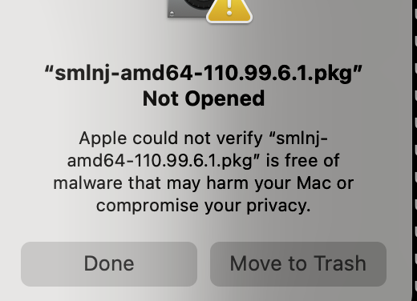

# dan-grossman-programming-languages
Examples, homeworks, and other materials for the programming language course by Dan Grossman: https://www.coursera.org/learn/programming-languages 


## Installation


### SMLNJ

This can be installed on macOS via homebrew but unfortunately it doesn't work out of the box.
The problem seems to be that the .pkg file isn't trusted by the system.




However, you can install the package manually:

- Download the file
- Go to System settings -> Privacy & Security
- Locate the message about the file
- Choose "Open Anyway"

Then add the bind directory to your path - here's an example for those using ZSH
```
# add this to your ~/.zshenv file
...
path+=("/usr/local/smlnj/bin")
export PATH
```


### Emacs

Install emacs, as usual.

For spacemacs, there's `sml` layer: https://github.com/syl20bnr/spacemacs/blob/develop/layers/+lang/sml/README.org

For it to work, you will have to have `sml` command on the PATH.
You may need to modify your emacs environment to make it work - for spacemacs, 
you can do it by appending `/usr/local/smlnj/bin` to the `PATH` variable in `.spacemacs.env`
